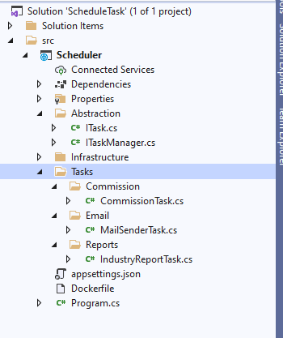

Schedule Task Design With Hangfire (.Net 5.0 )
==============================================





``` ITask.cs ``` interface
```cshap
public interface ITask
{
    void Execute();
}
```

``` MailSenderTask.cs ``` class
```cshap
public class MailSenderTask : ITask
{
    public void Execute()
    {
        //TODO:....
        Thread.Sleep(500);
    }
}
```

Task description ```ScheduleTasks``` scop in ``` appsettings.json ```
```json
{
    "Type": "Scheduler.Tasks.Email.MailSenderTask, Scheduler",
    "Name": "Mail Sender Task",
    "CronExpression": "*/5 * * ? * *",
    "Enabled": true
}
```
 - <b>Type</b> : "[class full name], [assembly name]"
 - <b>CronExpression</b> : A cron expression is a string consisting of six or seven subexpressions (fields) that describe individual details of the schedule. These fields, separated by white space, can contain any of the allowed values with various combinations of the allowed characters for that field.


installation in docker
----------------------
```docker 
_>docker-compose -f docker-compose.yml up --build 
```
<br />


For Cron Expression
---------------------
[wikipedia](https://en.wikipedia.org/wiki/Cron) <br />
[Hangfire Cronos](https://github.com/HangfireIO/Cronos) <br />
[free formatter](https://www.freeformatter.com/cron-expression-generator-quartz.html)

